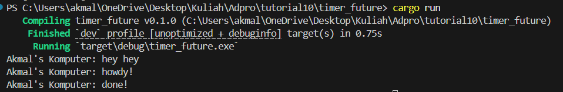
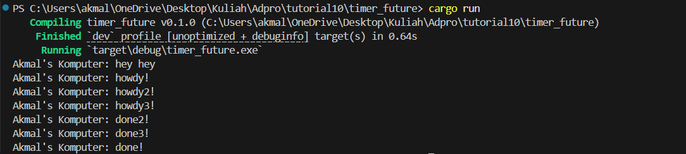
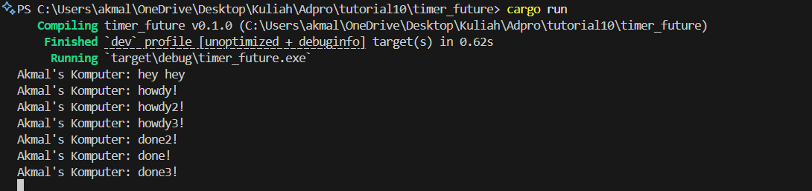

## AdvProg - Tutorial Module 10
<h2>
Nama   : Muhammad Akmal Abdul Halim

Kelas  : B

NPM    : 2306245125
</h2>

## Experiment 1.2: Understanding how it works.

Urutan ini terjadi karena cara eksekusi kode asinkron dalam Rust. Ketika saya menambahkan println!("Akmal's Komputer: hey hey"); dalam fungsi main() yang berada di luar task asynchronous, perintah ini dieksekusi secara langsung dan segera dalam alur utama program.

Perintah spawner.spawn(async {...}) hanya mendaftarkan tugas asinkron untuk dijalankan nanti oleh executor, bukan langsung menjalankannya. Setelah pendaftaran, program saya mencetak "hey hey", kemudian memanggil executor.run() yang baru mulai menjalankan tugas asinkron yang telah didaftarkan sebelumnya.

Dalam tugas asinkron tersebut, program mencetak "howdy!", menunggu selama 2 detik karena TimerFuture::new(Duration::new(2, 0)).await, dan akhirnya mencetak "done!". Inilah mengapa "hey hey" muncul terlebih dahulu, diikuti "howdy!" dan "done!" dengan jeda waktu di antaranya.

## Experiment 1.3: Multiple Spawn and removing drop.
#### Multiple Spawn:

Urutan ini terjadi karena cara kerja eksekusi asinkron di Rust. Pertama, println!("Akmal's Komputer: hey hey"); dijalankan langsung dalam thread utama sebelum tugas asinkron dimulai. Setelah itu, drop(spawner) dipanggil untuk memberitahu executor bahwa tidak akan ada tugas baru, dan kemudian executor.run() mulai menjalankan tugas-tugas yang sudah antri.

Executor mulai dengan tugas pertama yang mencetak "howdy!" kemudian menunggu selama 2 detik (karena TimerFuture::new(Duration::new(2, 0)).await). Selama tugas pertama menunggu, executor tidak idle tetapi beralih ke tugas kedua, yang mencetak "howdy2!" dan juga mulai menunggu. Kemudian executor beralih ke tugas ketiga yang mencetak "howdy3!" dan juga menunggu.

Setelah sekitar 2 detik, ketiga future menyelesaikan waktu tunggu mereka hampir bersamaan. Urutan "done2!", "done3!", dan "done!" mungkin bervariasi antara eksekusi program karena perbedaan kecil dalam waktu penyelesaian timer dan cara scheduler menangani tugas-tugas yang siap dijalankan kembali.

Inilah keunggulan pemrograman asinkron - memungkinkan beberapa operasi berjalan secara bersamaan tanpa saling memblokir, sehingga program tetap responsif meskipun sedang menunggu operasi yang membutuhkan waktu lama seperti timer.

#### Without Drop Spawner:

Setelah kita menghilangkan pemanggilan drop(spawner), program akan terus berjalan karena spawner masih menunggu kedatangan tugas baru. Padahal, dengan memanggil drop(spawner), kita menyampaikan ke executor bahwa tidak ada lagi tugas yang harus dijalankan, sehingga eksekusi bisa segera dihentikan.